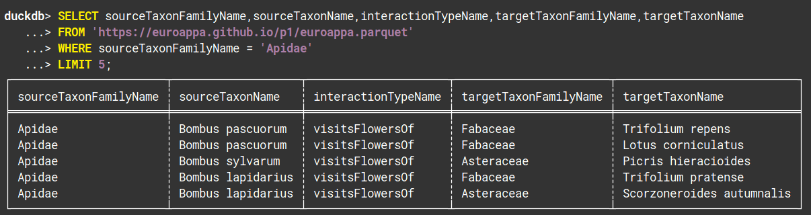

2026-02-23

# EuroAPPA prototype P1.

See [https://github.com/euroappa/euroappa.github.io](https://github.com/euroappa/euroappa.github.io/tree/main/p1) for associated files. Also, for other examples using these methods (e.g. duckdb, QGIS) see [https://www.globalbioticinteractions.org/2026/01/22/euroappa/](https://www.globalbioticinteractions.org/2026/01/22/euroappa/) . 

## Requirements

As part of our [https://en.wikipedia.org/wiki/Requirements_management](requirements management) process.

P1.R1. generate a list of plant - pollinator interaction records for a specific geospatial/taxonomic range

P1.R2. generate list of pollinators for a specific geospatial/taxonomic range

P1.R3  allows for a way to provide feedback (not yet implemented) 

Note that there's a difference between functional (e.g., generate a list of pollinators) and non-functional (e.g., solution should outlive the lifetime of the project, web accessible, data is versioned) requirements. 

### Features

A [feature](https://en.wikipedia.org/wiki/Software_feature) is "a prominent or distinctive user-visible aspect, quality, or characteristic of a software system or systems", as defined by Kang et al. 1990. A feature implements one or more requirements.

P1.F1. offers a [bash script](make.sh) to generate euroappa data products ```euroappa.gpkg```, [euroappa.parquet](euroappa.parquet) from a recent snapshot of [GloBI indexed interactions](https://globalbioticinteractions.org/data) using methods similar to [https://www.globalbioticinteractions.org/2026/01/22/euroappa/](https://www.globalbioticinteractions.org/2026/01/22/euroappa/). 

P1.F2. offers data workflows and data products for generating of insect pollinators by country using SQL and [DuckDB](https://duckdb.org) 
 * [insect-pollinators-of-europe.sql](insect-pollinators-of-europe.sql) ```-[generated]->``` [insect-pollinators-of-europe.csv](insect-pollinators-of-europe.csv), 
 * [insect-pollinators-of-ireland.sql](insect-pollinators-of-ireland.sql) ```-[generated]->``` [insect-pollinators-of-ireland.csv](insect-pollinators-of-ireland.csv) 
 *  [insect-pollinators-of-netherlands.sql](insect-pollinators-of-netherlands.sql)) ```-[:generated]->``` [insect-pollinators-of-netherlands.csv](insect-pollinators-of-netherlands.csv)

Example query:
```
SELECT DISTINCT 
  sourceTaxonFamilyName, 
  sourceTaxonName 
FROM 
  'euroappa.parquet'
WHERE
  sourceTaxonPathNames ~ '.*[^A-Z]Insecta[ ].*'
  AND sourceTaxonFamilyName NOT NULL 
  AND ISO3_CODE = 'IRL'
GROUP BY sourceTaxonFamilyName, sourceTaxonName 
ORDER BY sourceTaxonFamilyName, sourceTaxonName;
```

first 5 records:

| sourceTaxonFamilyName | sourceTaxonName |
| --- | --- |
| Andrenidae | Andrena |
| Andrenidae | Andrena carantonica |
| Andrenidae | Andrena cineraria |
| Andrenidae | Andrena fucata |
| Andrenidae | Andrena haemorrhoa |

P1.F3. offers data products containing country specific pollinator-plant association record datasets:
 * [insect-pollinator-plant-associations-of-europe.sql](insect-pollinator-plant-associations-of-europe.sql) ```-[:generated]``` -> [insect-pollinator-plant-associations-of-europe.csv](insect-pollinator-plant-associations-of-europe.csv)
 * [insect-pollinators-of-ireland.sql](insect-pollinators-associations-of-ireland.sql) ```-[:generated]->``` [insect-pollinators-of-ireland.csv](insect-pollinators-associations-of-ireland.csv)
 * [insect-pollinators-associations-of-netherlands.sql](insect-pollinators-associations-of-netherlands.sql) ```-[:generated]->``` [insect-pollinators-associations-of-netherlands.csv](insect-pollinators-associations-of-netherlands.csv))

Example query:

```
SELECT DISTINCT 
  sourceTaxonFamilyName as pollinatorFamily, 
  sourceTaxonName as pollinatorName,
  targetTaxonFamilyName as plantFamily,
  targetTaxonName as plantName,
FROM 
  'euroappa.parquet'
WHERE
  sourceTaxonPathNames ~ '.*[^A-Z]Insecta[ ].*'
  AND sourceTaxonFamilyName NOT NULL 
  AND ISO3_CODE = 'IRL'
GROUP BY sourceTaxonFamilyName, sourceTaxonName, targetTaxonFamilyName, targetTaxonName
ORDER BY sourceTaxonFamilyName, targetTaxonFamilyName, sourceTaxonName, targetTaxonName;
```

first 5 records:

| pollinatorFamily | pollinatorName | plantFamily | plantName |
| --- | --- | --- | --- |
| Andrenidae | Andrena haemorrhoa | Adoxaceae | Viburnum tinus |
| Andrenidae | Andrena carantonica | Asteraceae | Taraxacum |
| Andrenidae | Andrena haemorrhoa | Asteraceae | Taraxacum |
| Andrenidae | Andrena lapponica | Asteraceae | Taraxacum |
| Andrenidae | Andrena | Brassicaceae | Brassica napus |

P1.F4. allows for online queries through [```https://shell.duckdb.org/```](https://shell.duckdb.org) via top 10 most used programming language: SQL and [```euroappa.parquet```](euroappa.parquet) (< 20MiB). Example queries include [listing the first five interactions associated with bee family Apidae](https://shell.duckdb.org/#queries=v0,SELECT-sourceTaxonFamilyName%2CsourceTaxonName%2CinteractionTypeName%2CtargetTaxonFamilyName%2CtargetTaxonName%0AFROM-'https%3A%2F%2Feuroappa.github.io%2Fp1%2Feuroappa.parquet'-%0AWHERE-sourceTaxonFamilyName-%3D-'Apidae'%0ALIMIT-5~).  

[](https://shell.duckdb.org/#queries=v0,SELECT-sourceTaxonFamilyName%2CsourceTaxonName%2CinteractionTypeName%2CtargetTaxonFamilyName%2CtargetTaxonName%0AFROM-'https%3A%2F%2Feuroappa.github.io%2Fp1%2Feuroappa.parquet'-%0AWHERE-sourceTaxonFamilyName-%3D-'Apidae'%0ALIMIT-5~)

P1.F5. allows for spatial queries through QGIS and ```euroappa.gpkg``` (bigish dataset ~500MiB) data product.

P1.F6. data products (parquet files) are compatible with commercial data exploration platforms such as ArcGIS, MotherDuck, and have support for integration into R and Python.   

P1.F7. data products (csv files) are compatible with Excel and Google Sheet etc. 
