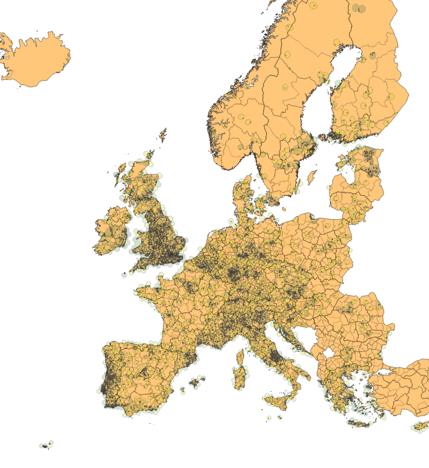
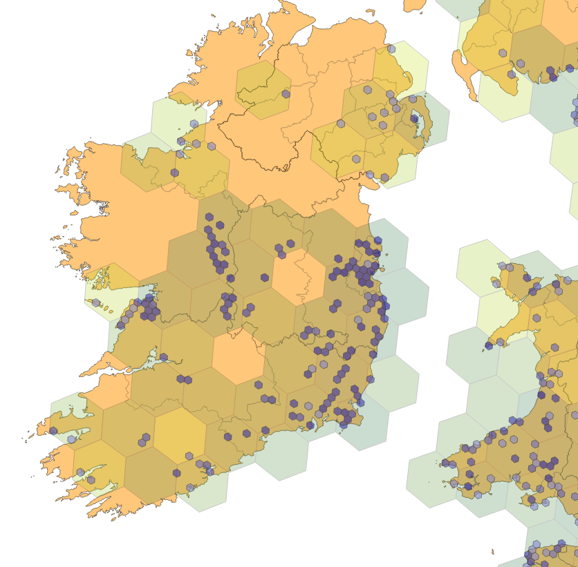
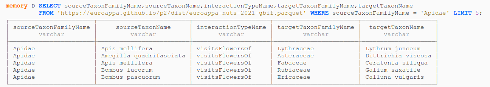

2026-05-20

! This is a work in progress !

Got questions? See [https://globalbioticinteractions.org/euroappa](https://globalbioticinteractions.org/euroappa) for more information, or reach out to Jorrit or Cala. 

# EuroAPPA prototype P3

**TLDR;** This prototypes offers integrated plant-pollinator [data products](#data-products) like [```euroappa-nuts-2021-gbif.csv```](https://github.com/euroappa/euroappa.github.io/releases/download/euroappa.p2/euroappa-nuts-2021-gbif.csv), [```euroappa-nuts-2021-col.parquet```](https://github.com/euroappa/euroappa.github.io/releases/download/euroappa.p2/euroappa-nuts-2021-col.parquet), [```euroappa-nuts-2021.gpkg```](https://euroappa.github.io/p2/dist/euroappa-nuts-2021-h3-level-4.gpkg) ([view summary on map](https://ngageoint.github.io/geopackage-viewer-js/?gpkg=https://euroappa.github.io/p2/dist/euroappa-nuts-2021-h3-level-4.gpkg&layers=euroappa-nuts-2021-h3-level-4)) and [```euroappa-cntr-2024-col.csv```](https://github.com/euroappa/euroappa.github.io/releases/download/euroappa.p2/euroappa-cntr-2024-col.csv) containing [geospatially aligned](#ref3) plant-pollinator records as interpreted from selected *versioned* taxonomic resources (e.g., [GBIF](#ref1), [Catalogue of Life](#ref2)) sourced from a *versioned* collection of [existing species interaction datasets](#ref6). For a more detailed description, see below.

```R
# R code - getting started
# load duckdb libraries for efficient data access
library(duckdb)
library(duckplyr)

# connect 
con <- dbConnect(duckdb())

# create view for convenient viewing
dbExecute(con,
  "CREATE VIEW euroappa AS
   SELECT * FROM PARQUET_SCAN('https://github.com/euroappa/euroappa.github.io/releases/download/euroappa.p2/euroappa-nuts-2021-col.parquet');")

# show first few records
tbl(con, "euroappa") |>
  head() |>
  collect()
```

```bash
# bash code for getting started
curl -L1 https://github.com/euroappa/euroappa.github.io/releases/download/euroappa.p2/euroappa-nuts-2021-col.tsv \
 | head 
```

<a href="examples/euroappa-p2-qgis-screenshot-2026-05-11.png"></a>

<a href="examples/euroappa-p2-qgis-screenshot-closeup-2026-05-11.png"></a> 

Screenshots of EuroAPPA record density as generated using QGIS 3.34 and EuroAPPA p2 data products and NUTS 2021.

See [https://github.com/euroappa/euroappa.github.io](https://github.com/euroappa/euroappa.github.io/tree/main/p2) for associated files. Also, for other examples using these methods (e.g. duckdb, QGIS) see [https://www.globalbioticinteractions.org/2026/01/22/euroappa/](https://www.globalbioticinteractions.org/2026/01/22/euroappa/) . 

## Changes

The following changes were facilitated by [p2](../p2) feedback of Andrea (!), Cala, Jeff, and Noa.

 * apply taxonomic name parsing to allow  ```Eupeodes sp.``` to be replace by ```Eupeodes```
 * include verbatim taxon names (e.g., sourceVerbatimTaxonName, targetVerbatimTaxonName) along with aligned taxon names (e.g., sourceTaxonName, targetTaxonName)
 * make checklist of Ireland more prominent

## Requirements

As part of our [https://en.wikipedia.org/wiki/Requirements_management](requirements management) process.

Note that there's a difference between functional (e.g., generate a list of pollinators) and non-functional (e.g., solution should outlive the lifetime of the project, web accessible, data is versioned) requirements. 

### Functional Requirements

P2.FR1. generate a list of plant - pollinator interaction records for a specific geospatial/taxonomic range

P2.FR2. generate list of pollinators for a specific geospatial/taxonomic range

P2.FR3  allows for a way to provide feedback (not yet implemented) 


## Features

A [feature](https://en.wikipedia.org/wiki/Software_feature) is "a prominent or distinctive user-visible aspect, quality, or characteristic of a software system or systems", as defined by Kang et al. 1990. A feature implements one or more requirements.

P2.F1. offers a [bash script](https://github.com/euroappa/euroappa.github.io/blob/58e8bf74ab1999b098054da82e6439ab496e892d/p2/bin/make.sh) to implement an automated workflow to generate euroappa data products. These data products are deposited in Zenodo and were derived a versioned copy of the GloBI Data Review Corpus [[3]](#ref3) and selected taxonomic and geospatial databases ([1,2,4,5]) 

highlevel workflow:

```
 synthesized interaction data 
  + taxonomic alignment 
  + geospatial alignment 
         = EuroAPPA P2 data products
```

P2.F2. offers data workflows and data products for generating of insect pollinators by country using SQL and [DuckDB](https://duckdb.org) 
 * [insect-pollinators-of-ireland.sql](insect-pollinators-of-ireland.sql) ```-[generated]->``` [insect-pollinators-of-ireland.csv](insect-pollinators-of-ireland.csv) 

Example query:
```
SELECT DISTINCT 
  sourceTaxonFamilyName, 
  sourceTaxonName 
FROM 
  'https://github.com/euroappa/euroappa.github.io/releases/download/euroappa.p2/euroappa-nuts-2021-col.parquet'
WHERE
  sourceTaxonPathNames ~ '.*[^A-Z]Insecta[ ].*'
  AND sourceTaxonFamilyName NOT NULL
  -- Ireland Statistical Regions https://en.wikipedia.org/wiki/NUTS_statistical_regions_of_Ireland
  -- NUTS Level 3 West: IE042 
  AND NUTS_ID = 'IE042'
GROUP BY sourceTaxonFamilyName, sourceTaxonName 
ORDER BY sourceTaxonFamilyName, sourceTaxonName;
```

first 5 records:

| sourceTaxonFamilyName | sourceTaxonName |
| --- | --- |
| Andrenidae | Andrena |
| Andrenidae | Andrena angustior |
| Andrenidae | Andrena cineraria |
| Andrenidae | Andrena clarkella |
| Andrenidae | Andrena minutula |

P2.F3. offers data products containing country specific pollinator-plant association record datasets:
 * [insect-pollinators-of-ireland.sql](insect-pollinators-associations-of-ireland.sql) ```-[:generated]->``` [insect-pollinators-of-ireland.csv](insect-pollinators-associations-of-ireland.csv)

Example query:

```
SELECT DISTINCT 
  sourceTaxonFamilyName as pollinatorFamily, 
  sourceTaxonName as pollinatorName,
  targetTaxonFamilyName as plantFamily,
  targetTaxonName as plantName,
FROM 
  'https://github.com/euroappa/euroappa.github.io/releases/download/euroappa.p2/euroappa-nuts-2021-col.parquet'
WHERE
  sourceTaxonPathNames ~ '.*[^A-Z]Insecta[ ].*'
  AND sourceTaxonFamilyName NOT NULL 
  AND targetTaxonFamilyName NOT NULL 
-- Ireland Statistical Regions https://en.wikipedia.org/wiki/NUTS_statistical_regions_of_Ireland
  -- NUTS Level 3 West: IE042 
  AND NUTS_ID = 'IE042'
GROUP BY sourceTaxonFamilyName, sourceTaxonName, targetTaxonFamilyName, targetTaxonName
ORDER BY sourceTaxonFamilyName, targetTaxonFamilyName, sourceTaxonName, targetTaxonName;
```

first 5 records:

| pollinatorFamily | pollinatorName | plantFamily | plantName |
| --- | --- | --- | --- |
| Andrenidae | Andrena | Apiaceae | Pimpinella saxifraga |
| Andrenidae | Andrena clarkella | Apiaceae | Pimpinella saxifraga |
| Andrenidae | Andrena semilaevis | Apiaceae | Pimpinella saxifraga |
| Andrenidae | Andrena angustior | Asteraceae | Leontodon crispus |
| Andrenidae | Andrena minutula | Asteraceae | Bellis perennis |

P2.F4. allows for online queries through services like [```https://shell.duckdb.org/```](https://shell.duckdb.org) and [SQL](https://en.wikipedia.org/wiki/SQL), a top 10 most used programming language. Example queries include listing the first five interactions associated with bee family Apidae as aligned with GBIF Taxonomy and NUTS 2021. 

[](https://shell.duckdb.org/)

using query:

```SQL
SELECT sourceTaxonFamilyName,sourceTaxonName,interactionTypeName,targetTaxonFamilyName,targetTaxonName
FROM 'https://euroappa.github.io/p2/dist/euroappa-nuts-2021-gbif.parquet'
WHERE sourceTaxonFamilyName = 'Apidae'
LIMIT 5;
```

P2.F5. allows for spatial queries through QGIS and [```euroappa-nuts-2021.gpkg```](https://github.com/euroappa/euroappa.github.io/releases/download/euroappa.p2/euroappa-nuts-2021.gpkg), [```euroappa-nuts-2021-h3-level-4.gpkg```](dist/euroappa-nuts-2021-h3-level-4.gpkg), [```euroappa-nuts-2021-h3-level-6.gpkg```](dist/euroappa-nuts-2021-h3-level-6.gpkg) and [```euroappa-nuts-2021.gpkg```](https://github.com//euroappa-nuts-2021-h3-level-6.gpkg) related (bigish dataset ~500MiB) data products. 

P2.F6. data products (parquet files) are compatible with commercial data exploration platforms such as ArcGIS, MotherDuck, and have support for integration into R and Python.   

P2.F7. data products (csv files) are compatible with Excel and Google Sheet etc. 


## Data Products

 interaction data corpus | geospatial scheme | taxonomic scheme | products | 
 --- | --- | --- | ---
 GloBI 2026 [[6]](#ref6) | [NUTS 2021](https://ec.europa.eu/eurostat/web/gisco/geodata/statistical-units/territorial-units-statistics ) [euroappa-nuts-2021.gpkg](https://github.com/euroappa/euroappa.github.io/releases/download/euroappa.p2/euroappa-nuts-2021.gpkg) | GBIF Taxonomic Backbone [[1]](#ref1) | [euroappa-nuts-2021-gbif.csv](https://github.com/euroappa/euroappa.github.io/releases/download/euroappa.p2/euroappa-nuts-2021-gbif.csv) / [.tsv](https://github.com/euroappa/euroappa.github.io/releases/download/euroappa.p2/euroappa-nuts-2021-gbif.tsv) / [.parquet](https://github.com/euroappa/euroappa.github.io/releases/download/euroappa.p2/euroappa-nuts-2021-gbif.parquet)
 GloBI 2026 [[6]](#ref6) | [CNTR 2024](https://ec.europa.eu/eurostat/web/gisco/geodata/administrative-units/countries) [euroappa-cntr-2024.gpkg](https://github.com/euroappa/euroappa.github.io/releases/download/euroappa.p2/euroappa-cntr-2024.gpkg) | GBIF Taxonomic Backbone [[1]](#ref1) | [euroappa-cntr-2024-gbif.csv](https://github.com/euroappa/euroappa.github.io/releases/download/euroappa.p2/euroappa-cntr-2024-gbif.csv) / [.tsv](https://github.com/euroappa/euroappa.github.io/releases/download/euroappa.p2/euroappa-cntr-2024-gbif.tsv) / [.parquet](dist/euroappa-cntr-2024-gbif.tsv)
 GloBI 2026 [[6]](#ref6) | [NUTS 2021](https://ec.europa.eu/eurostat/web/gisco/geodata/statistical-units/territorial-units-statistics ) [euroappa-nuts-2021.gpkg](https://github.com/euroappa/euroappa.github.io/releases/download/euroappa.p2/euroappa-nuts-2021.gpkg) | Catalogue of Life [[2]](#ref2) | [euroappa-nuts-2021-col.csv](https://github.com/euroappa/euroappa.github.io/releases/download/euroappa.p2/euroappa-nuts-2021-col.csv) / [.tsv](https://github.com/euroappa/euroappa.github.io/releases/download/euroappa.p2/euroappa-nuts-2021-col.tsv) / [.parquet](dist/euroappa-nuts-2021-col.parquet)
 GloBI 2026 [[6]](#ref6) | [CNTR 2024](https://ec.europa.eu/eurostat/web/gisco/geodata/administrative-units/countries) [euroappa-cntr-2024.gpkg](https://github.com/euroappa/euroappa.github.io/releases/download/euroappa.p2/euroappa-cntr-2024.gpkg) | Catalogue of Life [[2]](#ref2) | [euroappa-cntr-2024-col.csv](https://github.com/euroappa/euroappa.github.io/releases/download/euroappa.p2/euroappa-cntr-2024-col.csv) / [.tsv](https://github.com/euroappa/euroappa.github.io/releases/download/euroappa.p2/euroappa-cntr-2024-col.tsv) / [.parquet](https://github.com/euroappa/euroappa.github.io/releases/download/euroappa.p2/euroappa-cntr-2024-col.parquet)

## Data Schemas 

### NUTS Associated Schemas

As generated from 

```
duckdb \
 -markdown \
 -c "describe 'https://github.com/euroappa/euroappa.github.io/releases/download/euroappa.p2/euroappa-nuts-2021-col.parquet';"
```

|       column_name       | column_type | null | key  | default | extra |
|-------------------------|-------------|------|------|---------|-------|
| decimalLatitude         | DOUBLE      | YES  | NULL | NULL    | NULL  |
| decimalLongitude        | DOUBLE      | YES  | NULL | NULL    | NULL  |
| sourceTaxonId           | VARCHAR     | YES  | NULL | NULL    | NULL  |
| sourceTaxonName         | VARCHAR     | YES  | NULL | NULL    | NULL  |
| sourceTaxonAuthorship   | VARCHAR     | YES  | NULL | NULL    | NULL  |
| sourceTaxonFamilyId     | VARCHAR     | YES  | NULL | NULL    | NULL  |
| sourceTaxonFamilyName   | VARCHAR     | YES  | NULL | NULL    | NULL  |
| sourceTaxonPathIds      | VARCHAR     | YES  | NULL | NULL    | NULL  |
| sourceTaxonPathNames    | VARCHAR     | YES  | NULL | NULL    | NULL  |
| sourceTaxonNameRelation | VARCHAR     | YES  | NULL | NULL    | NULL  |
| interactionTypeName     | VARCHAR     | YES  | NULL | NULL    | NULL  |
| targetTaxonId           | VARCHAR     | YES  | NULL | NULL    | NULL  |
| targetTaxonName         | VARCHAR     | YES  | NULL | NULL    | NULL  |
| targetTaxonAuthorship   | VARCHAR     | YES  | NULL | NULL    | NULL  |
| targetTaxonFamilyId     | VARCHAR     | YES  | NULL | NULL    | NULL  |
| targetTaxonFamilyName   | VARCHAR     | YES  | NULL | NULL    | NULL  |
| targetTaxonPathIds      | VARCHAR     | YES  | NULL | NULL    | NULL  |
| targetTaxonPathNames    | VARCHAR     | YES  | NULL | NULL    | NULL  |
| targetTaxonNameRelation | VARCHAR     | YES  | NULL | NULL    | NULL  |
| eventDate               | TIMESTAMP   | YES  | NULL | NULL    | NULL  |
| referenceCitation       | VARCHAR     | YES  | NULL | NULL    | NULL  |
| citation                | VARCHAR     | YES  | NULL | NULL    | NULL  |
| namespace               | VARCHAR     | YES  | NULL | NULL    | NULL  |
| lastSeenAt              | TIMESTAMP   | YES  | NULL | NULL    | NULL  |
| CNTR_CODE               | VARCHAR     | YES  | NULL | NULL    | NULL  |
| NUTS_ID                 | VARCHAR     | YES  | NULL | NULL    | NULL  |
| NUTS_NAME               | VARCHAR     | YES  | NULL | NULL    | NULL  |
| LEVL_CODE               | BIGINT      | YES  | NULL | NULL    | NULL  |

with an example record from NUTS ID PT200 (Região Autónoma dos Açores) shown below as generated via

```
duckdb \
 -csv \
 -c "select * from 'https://github.com/euroappa/euroappa.github.io/releases/download/euroappa.p2/euroappa-nuts-2021-col.parquet' WHERE NUTS_ID = 'PT200' limit 1;" \
  | mlr --icsv --oxtab cat
```

yielding

```
decimalLatitude         38.6747398333
decimalLongitude        -27.2511157778
sourceTaxonId           COL:4YRBX
sourceTaxonName         Sphaerophoria scripta
sourceTaxonAuthorship    (Linnaeus, 1758)
sourceTaxonFamilyId     COL:GVS
sourceTaxonFamilyName   Syrphidae
sourceTaxonPathIds      COL:CS5HF   COL:N   COL:RT   COL:L2655   COL:H6   COL:D2P   COL:GVS   COL:87CNM   COL:87CZ8   COL:BY4GV   COL:BY4GW   COL:4YRBX
sourceTaxonPathNames    Eukaryota   Animalia   Arthropoda   Hexapoda   Insecta   Diptera   Syrphidae   Syrphinae   Syrphini   Sphaerophoria   Sphaerophoria (Sphaerophoria)   Sphaerophoria scripta
sourceTaxonNameRelation HAS_ACCEPTED_NAME
interactionTypeName     visitsFlowersOf
targetTaxonId           COL:622TP
targetTaxonName         Asteraceae
targetTaxonAuthorship    Dumort.
targetTaxonFamilyId     COL:622TP
targetTaxonFamilyName   Asteraceae
targetTaxonPathIds      COL:CS5HF   COL:P   COL:CMQ8S   COL:TP   COL:MG   COL:ST   COL:622TP
targetTaxonPathNames    Eukaryota   Plantae   Pteridobiotina   Tracheophyta   Magnoliopsida   Asterales   Asteraceae
targetTaxonNameRelation HAS_ACCEPTED_NAME
eventDate               2025-06-11 15:20:24
referenceCitation       https://www.inaturalist.org/observations/289117707
citation                http://iNaturalist.org is a place where you can record what you see in nature, meet other nature lovers, and learn about the natural world.
namespace               globalbioticinteractions/inaturalist
lastSeenAt              2026-05-06 15:48:15.203
CNTR_CODE               PT
NUTS_ID                 PT200
NUTS_NAME               Região Autónoma dos Açores
LEVL_CODE               3
```

## CNTR Associated Schemas 

As generated from 

```
duckdb \
 -markdown \
 -c "describe 'https://github.com/euroappa/euroappa.github.io/releases/download/euroappa.p2/euroappa-cntr-2024-col.parquet';"
```

|       column_name       | column_type | null | key  | default | extra |
|-------------------------|-------------|------|------|---------|-------|
| decimalLatitude         | DOUBLE      | YES  | NULL | NULL    | NULL  |
| decimalLongitude        | DOUBLE      | YES  | NULL | NULL    | NULL  |
| sourceTaxonId           | VARCHAR     | YES  | NULL | NULL    | NULL  |
| sourceTaxonName         | VARCHAR     | YES  | NULL | NULL    | NULL  |
| sourceTaxonAuthorship   | VARCHAR     | YES  | NULL | NULL    | NULL  |
| sourceTaxonFamilyId     | VARCHAR     | YES  | NULL | NULL    | NULL  |
| sourceTaxonFamilyName   | VARCHAR     | YES  | NULL | NULL    | NULL  |
| sourceTaxonPathIds      | VARCHAR     | YES  | NULL | NULL    | NULL  |
| sourceTaxonPathNames    | VARCHAR     | YES  | NULL | NULL    | NULL  |
| sourceTaxonNameRelation | VARCHAR     | YES  | NULL | NULL    | NULL  |
| interactionTypeName     | VARCHAR     | YES  | NULL | NULL    | NULL  |
| targetTaxonId           | VARCHAR     | YES  | NULL | NULL    | NULL  |
| targetTaxonName         | VARCHAR     | YES  | NULL | NULL    | NULL  |
| targetTaxonAuthorship   | VARCHAR     | YES  | NULL | NULL    | NULL  |
| targetTaxonFamilyId     | VARCHAR     | YES  | NULL | NULL    | NULL  |
| targetTaxonFamilyName   | VARCHAR     | YES  | NULL | NULL    | NULL  |
| targetTaxonPathIds      | VARCHAR     | YES  | NULL | NULL    | NULL  |
| targetTaxonPathNames    | VARCHAR     | YES  | NULL | NULL    | NULL  |
| targetTaxonNameRelation | VARCHAR     | YES  | NULL | NULL    | NULL  |
| eventDate               | TIMESTAMP   | YES  | NULL | NULL    | NULL  |
| referenceCitation       | VARCHAR     | YES  | NULL | NULL    | NULL  |
| citation                | VARCHAR     | YES  | NULL | NULL    | NULL  |
| namespace               | VARCHAR     | YES  | NULL | NULL    | NULL  |
| lastSeenAt              | TIMESTAMP   | YES  | NULL | NULL    | NULL  |
| ISO3_CODE               | VARCHAR     | YES  | NULL | NULL    | NULL  |
| CNTR_ID                 | VARCHAR     | YES  | NULL | NULL    | NULL  |
| NAME_ENGL               | VARCHAR     | YES  | NULL | NULL    | NULL  |

With example record from country code ```IRL``` (Ireland) generated via: 

```
duckdb \
 -csv \
 -c "SELECT * from 'https://github.com/euroappa/euroappa.github.io/releases/download/euroappa.p2/euroappa-cntr-2024-col.parquet' WHERE ISO3_CODE = 'IRL' limit 1;" \
  | mlr --icsv --oxtab cat
```

yielding

```
decimalLatitude         53.13666534423828
decimalLongitude        -9.114999771118164
sourceTaxonId           COL:MFLX
sourceTaxonName         Bombus jonellus
sourceTaxonAuthority    (Kirby, 1802)
sourceTaxonFamilyId     COL:6KD
sourceTaxonFamilyName   Apidae
sourceTaxonPathIds      COL:CS5HF   COL:N   COL:RT   COL:L2655   COL:H6   COL:HYM   COL:KZPW7   COL:KZMNP   COL:625GP   COL:6KD   COL:J5V   COL:KN5   COL:62H8K   COL:MFLX
sourceTaxonPathNames    Eukaryota   Animalia   Arthropoda   Hexapoda   Insecta   Hymenoptera   Apocrita   Aculeata   Apoidea   Apidae   Apinae   Bombini   Bombus   Bombus jonellus
sourceTaxonNameRelation HAS_ACCEPTED_NAME
interactionTypeName     pollinates
targetTaxonId           COL:768LJ
targetTaxonName         Pedicularis sylvatica
targetTaxonAuthority    L.
targetTaxonFamilyId     COL:DQG
targetTaxonFamilyName   Orobanchaceae
targetTaxonPathIds      COL:CS5HF   COL:P   COL:CMQ8S   COL:TP   COL:MG   COL:3F4   COL:DQG   COL:KVNJK   COL:6JYZ   COL:768LJ
targetTaxonPathNames    Eukaryota   Plantae   Pteridobiotina   Tracheophyta   Magnoliopsida   Lamiales   Orobanchaceae   Pedicularideae   Pedicularis   Pedicularis sylvatica
targetTaxonNameRelation HAS_ACCEPTED_NAME
eventDate               2017-06-02 00:00:00
referenceCitation       doi:10.1111/1365-2664.13990
citation                Lanuza et al. (2025), EuPPollNet: A European Database of Plant-Pollinator Networks. Global Ecol Biogeogr, 34: e70000. https://doi.org/10.1111/geb.70000
namespace               JoseBSL/EuPPollNet
lastSeenAt              2026-05-06 22:50:55.128
ISO3_CODE               IRL
CNTR_ID                 IE
NAME_ENGL               Ireland
```

## References

<div id="ref1"/>[[1]](#ref1) GBIF Secretariat (2023). GBIF Backbone Taxonomy. Checklist dataset https://doi.org/10.15468/39omei 

<div id="ref2"/>[[2]](#ref2) Bánki, O., Roskov, Y., Döring, M., Ower, G., Vandepitte, L., Hobern, D., Remsen, D., Schalk, P., DeWalt, R. E., Keping, M., Miller, J., Orrell, T., Aalbu, R., Adlard, R., Adriaenssens, E., Aedo, C., Aescht, E., Akkari, N., Alonso-Zarazaga, M. A., et al. (2022). Catalogue of Life Checklist (Version 2022-01-14). Catalogue of Life. https://doi.org/10.48580/d4tp

<div id="ref3"/>[[3]](#ref3) Poelen, J. H. (ed . ) . (2026). Nomer Corpus of Taxonomic Resources hash://sha256/14b77b8b7561fea78691723c093b62ce3dffb3672a790cd9da0ab3e045145387 hash://md5/8ed9e0756e3d8ac23c014dbdb9006e4e (0.33) [Data set]. Zenodo. https://doi.org/10.5281/zenodo.19924910

<div id="ref4"/>[[4]](#ref4) Administrative Units: Countries (2024) https://ec.europa.eu/eurostat/web/gisco/geodata/administrative-units/countries https://gisco-services.ec.europa.eu/distribution/v2/nuts/gpkg/CNTR_RG_01M_2024_4326.gpkg hash://md5/f1472535e38a026bd4df4228caf01f82 accessed May 2026. 

<div id="ref5"/>[[5]](#ref5) Territorial units for statistics (NUTS) (2021) https://ec.europa.eu/eurostat/web/gisco/geodata/statistical-units/territorial-units-statistics 'https://gisco-services.ec.europa.eu/distribution/v2/nuts/gpkg/NUTS_RG_01M_2021_4326.gpkg' hash://md5/9e1146e52a2cb5e4a34153facaf50b0b

<div id="ref6"/>[[6]](#ref6) Poelen, J. H., & Global Biotic Interactions Community. (2026). Global Biotic Interactions (GloBI) Review Dataset Corpus hash://md5/9f9f111af19f657e31ce04b9d422eed4 hash://sha256/8467e21bf1194cbbcb201b3ee2bbee0e2d657a772b4e3ce62fc63afe9116c626 [Data set]. Zenodo. https://doi.org/10.5281/zenodo.20072186

